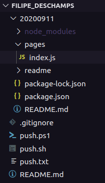

# [Filipe Deschamps](https://www.youtube.com/FilipeDeschamps)

[Como Programar Sites Difíceis de Cair? (Qualidade Profissional)](https://www.youtube.com/watch?v=IyRUn0GocEc)

## React Framework

[Next.js](https://nextjs.org/)

### Next File System Routing

https://nuxtjs.org/docs/2.x/features/file-system-routing/

### Create "package.json"

```
npm init -y
```

### Install dependencies

```
npm install next
```

```
npm install react
```

```
npm install react-dom
```

or  

```
npm install next react react-dom
```

### Create a ```pages``` folder and an ```index.js``` file inside (or ```index.ts```)

  

### Create a script in the file "package.json"

```
  "scripts": {
    "dev": "next dev"
  },
```

### Run the project

```
npm run dev
```

### Deploy

https://www.youtube.com/watch?v=EW7m2WIvFgQ&t=23m05s  

### Register a domain name in Brazil

[registro.br](https://registro.br/)

### Vercel

https://vercel.com/  

### DNS Propagation Checker

[whatsmydns.net](https://www.whatsmydns.net/)  